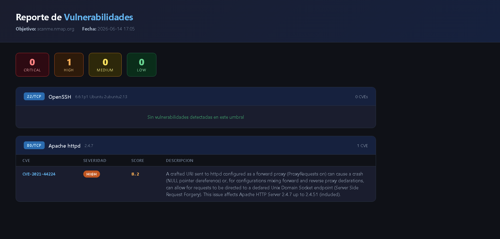

# pyvulnscan


Herramienta de línea de comandos que escanea puertos abiertos en un objetivo, detecta los servicios que corren en ellos y busca CVEs conocidos en la base de datos NVD (NIST). Genera reportes en JSON y HTML.

---

## ⚠️ Uso responsable

Esta herramienta es **solo para fines educativos**. Escanea únicamente sistemas de tu propiedad o para los que tengas **autorización explícita por escrito**. El escaneo de puertos no autorizado es ilegal en la mayoría de las jurisdicciones y muchos sistemas lo registran como un intento de ataque.

Para practicar de forma segura puedes usar:

- `scanme.nmap.org` — objetivo público autorizado por Nmap (sin abusar).
- `127.0.0.1` / tu propia red local.
- Máquinas virtuales vulnerables como **Metasploitable2**, **DVWA** o **OWASP Juice Shop**.

---

## Demo



> Sube una captura de tu `reporte.html` a una carpeta `docs/` y enlázala aquí. Es lo que más vende el proyecto a primera vista.

---

## Requisitos

- Python 3.10+
- Nmap instalado en el sistema ([nmap.org](https://nmap.org/download.html))
- API key de NVD (gratuita en [nvd.nist.gov/developers/request-an-api-key](https://nvd.nist.gov/developers/request-an-api-key))

---

## Instalación

```bash
git clone https://github.com/bntkpp/pyvulnscan.git
cd pyvulnscan
python -m venv venv
venv\Scripts\activate        # Windows
# source venv/bin/activate   # Linux / macOS
pip install -r requirements.txt
```

Crea el archivo `.env` en la raíz del proyecto con tu API key:

```
NVD_API_KEY=tu_api_key_aqui
```

---

## Uso

```bash
python main.py
```

```
=== Scanner de Vulnerabilidades ===
Ingresa la IP o dominio a escanear: scanme.nmap.org

[*] Escaneando puertos...
[+] Puertos abiertos: [22, 80]
[*] Detectando servicios...
[*] Buscando CVEs para: OpenSSH 6.6.1p1
[*] Buscando CVEs para: Apache httpd 2.4.7
[+] Listo. Revisa reporte.json y reporte.html
```

---

## Cómo funciona

1. **Escaneo de puertos** — abre conexiones TCP (connect scan) sobre una lista de puertos comunes para detectar cuáles están abiertos.
2. **Detección de servicios** — usa `nmap -sV` para identificar el producto y la versión de cada servicio (ej. `Apache httpd 2.4.7`).
3. **Búsqueda de CVEs** — consulta la API de la NVD por cada servicio y recupera las vulnerabilidades conocidas con su puntaje CVSS.
4. **Filtrado por severidad** — descarta los CVEs por debajo del umbral elegido (LOW / MEDIUM / HIGH / CRITICAL).
5. **Reportes** — genera un `reporte.json` (datos crudos) y un `reporte.html` (visual, con colores por severidad y links a la NVD).

---

## Estructura

```
pyvulnscan/
├── main.py              # Punto de entrada (CLI interactiva)
├── requirements.txt
├── .env                 # API key (no subir al repo)
├── scanner/
│   ├── ports.py         # Escaneo TCP de puertos
│   ├── services.py      # Detección de servicios con nmap -sV
│   ├── cve.py           # Consulta a la API de NVD
│   └── report.py        # Generación de reporte JSON y HTML
└── templates/
    └── report.html      # Template Jinja2 del reporte
```

---

## Salida

| Archivo        | Descripción                                 |
| -------------- | ------------------------------------------- |
| `reporte.json` | Datos crudos del escaneo en formato JSON    |
| `reporte.html` | Reporte visual con tabla de CVEs por puerto |

---

## Dependencias

| Librería        | Uso                              |
| --------------- | -------------------------------- |
| `python-nmap`   | Detección de servicios vía nmap  |
| `requests`      | Consultas a la API de NVD        |
| `jinja2`        | Renderizado del reporte HTML     |
| `python-dotenv` | Carga de variables de entorno    |
| `rich`          | Colores y formato en la terminal |

---

## Mejoras futuras

- Precisión con CPE para reducir falsos positivos de la búsqueda por palabra clave.
- Escaneo concurrente de puertos con `ThreadPoolExecutor`.
- Argumentos de CLI con `argparse` (`--target`, `--ports`, `--severity`).
- Detección de sistema operativo (`nmap -O`).

---

## Licencia

Distribuido bajo la licencia MIT. Ver el archivo [`LICENSE`](LICENSE) para más detalles.